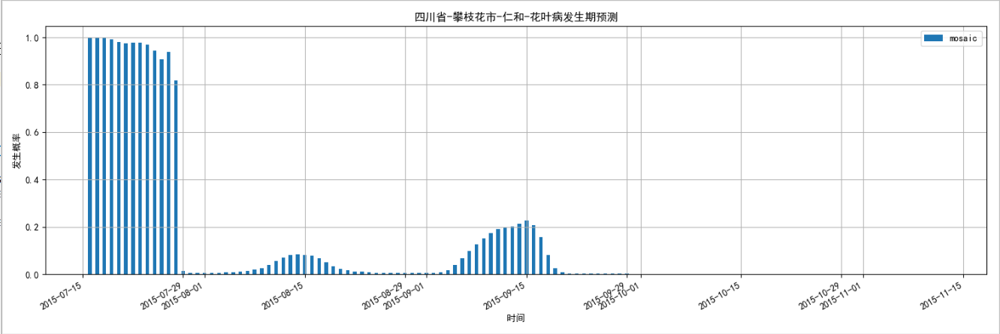
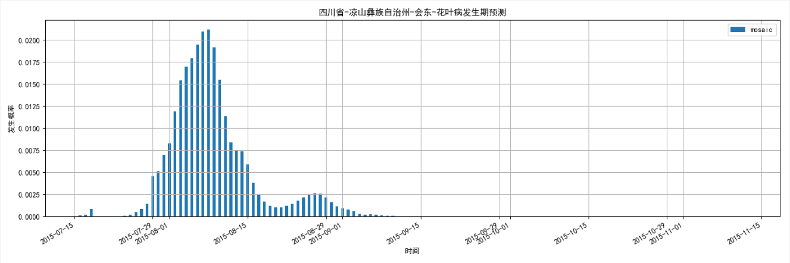
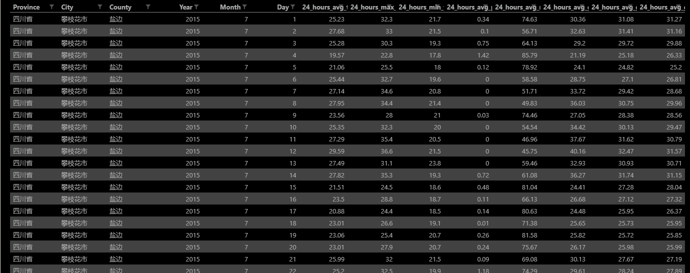

# 烟草病害预测示例

## 说明

烟草病害预测工具`tobacco_diseases`是一个根据以往一段时间（以天为单位）的气象情况，来预测未来一段时间里的各地区的各种病（花叶病、烟青虫病、黑胫病、青枯病、蚜虫）的发生概率以及发生量的工具。

## 环境要求

python: 3.6

## 安装

根据不同的包管理器执行以下命令进行安装：

### 包管理器为Pip

```sh
pip3 install https://download.pytorch.org/whl/cpu/torch-1.1.0-cp36-cp36m-win_amd64.whl
pip3 install tobacco_diseases-0.1.tar.gz
```

### 包管理器为Conda

假设环境名为`test36`

```sh
source activate test36
conda install pytorch-cpu torchvision-cpu -c pytorch
pip install tobacco_diseases-0.1.tar.gz
```

## 使用步骤

1. 创建预测类

    通过装载模型权重，创建预测类`Predictor`：

    ```python
    from tobacco_diseases.visual import diseases_result_visual
    from tobacco_diseases.predictor import Predictor

    if __name__ == '__main__':
        predictor = Predictor.create(
            diseases_model_weights="../model/weights_diseases_742_0.05.pt",
            weather_model_weights="../model/weights_weather_139_0.005.pt")
    ```

2. 使用已有的气象数据`../data/diseases_data/forecast_test.csv`进行预测：

    ```python
        results = predictor.forecast("../data/diseases_data/forecast_test.csv",
                                 num_pre=15,
                                 num_future=120,
                                 spacing=1,
                                 levels=[0.005, 0.01, 0.012],
                                 combine=True)
    ```

    方法`forecast`参数说明：
    1. weather_dataset: 气象数据文件路径，文件格式见**输入文件格式说明**
    2. num_pre: 指定使用前几天的气象数据做预测，如上为前15天
    3. num_future: 决定预测未来几天的预测值，如上为未来120天
    4. spacing: 抽样间隔，按照一定间隔从预测值中抽样，1 < spacing < num_future，spacing越大，计算速度越快
    5. levels: 等级，将发生量按等级分级，如levels=[0.01,0.015,0.02]，则会分为0-3，4个等级
    6. combine: 如果为真，则将所有地区的预测合并为一个文件

3. 将预测结果保存为文件：

    ```python
        results.to_csv("../data/forecast_result.csv", index=False)
    ```

4. (可选) 可视化预测结果

    如下所示，可使用`diseases_result_visual`可视化预测结果：

    ```python
    from tobacco_diseases.visual import diseases_result_visual

    if __name__ == '__main__':
        results = ...
        diseases_result_visual(
            results,
            column='mosaic',
            xlabel=u'时间',
            ylabel=u'发生概率',
            title=u'{place}-花叶病发生期预测')
    ```

    如上的代码将各地区的花叶病（column设为mosaic)的未来12旬的发病概率进行可视化：
    
    

    同样也可将发病量与发病程度进行可视化：

    ```python
        diseases_result_visual(results, 
            column='mosaic_quantity', 
            xlabel=u'时间', 
            ylabel=u'发生量（担/亩）',
            title=u'{place}-花叶病发生量预测')
        diseases_result_visual(results, 
            column='mosaic_level', xlabel=u'时间', 
            ylabel=u'病害程度',
            title=u'{place}-花叶病发病程度预测')
    ```
## 输入与输出文件格式说明

### 输入文件

输入文件为包含下面各列的气象csv文件，并按照地区时间升序排列：

* province (省)
* city (市)
* county (县)
* year (年)
* month (月)
* day (日)
* 24_hours_avg_tem (24小时平均气温)
* 24_hours_max_tem (24小时最高气温)
* 24_hours_min_tem (24小时最低气温)
* 24_hours_avg_pre (24小时平均降水量)
* 24_hours_avg_rhu (24小时平均湿度)
* 24_hours_avg_gst (24小时平均地面温度)
* 24_hours_avg_gst_15cm (24小时平均离地15cm温度)
* 24_hours_avg_gst_20cm (24小时平均离地20cm温度)

输入源文件格式如下：

**注意**：

1. **输入源文件中包含有哪几个地区的气象数据，则输出结果中就包含那几个地区的病害预测结果**。
2. **若要通过以往15天的气象数据进行预测，则每个地区至少需包含连续15天的气象数据**



### 输出文件

输出文件包含了未来12旬的病害预测情况，同样为csv文件格式，并按照地区时间升序排列，包含以下各列：

* year (年)
* month (月)
* day   (日)
* province (省)
* city (市)
* county (县)
* mosaic (花叶病发病概率)
* black_shank (黑胫病发病概率)
* bacterial_wilt (青枯病发病概率)
* budworm (烟青虫病发病概率)
* aphids (蚜虫发病概率)
* mosaic_quantity (花叶病发病量)
* black_shank_quantity (黑胫病发病量)
* bacterial_wilt_quantity (青枯病发病量)
* budworm_quantity (烟青虫病发病量)
* aphids_quantity (蚜虫发病量)
* mosaic_level (花叶病发病程度)
* black_shank_level (黑胫病发病程度)
* bacterial_wilt_level (青枯病发病程度)
* budworm_level (烟青虫病发病程度)
* aphids_level (蚜虫发病程度)
